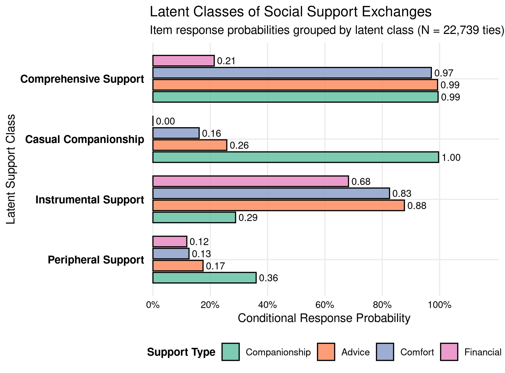
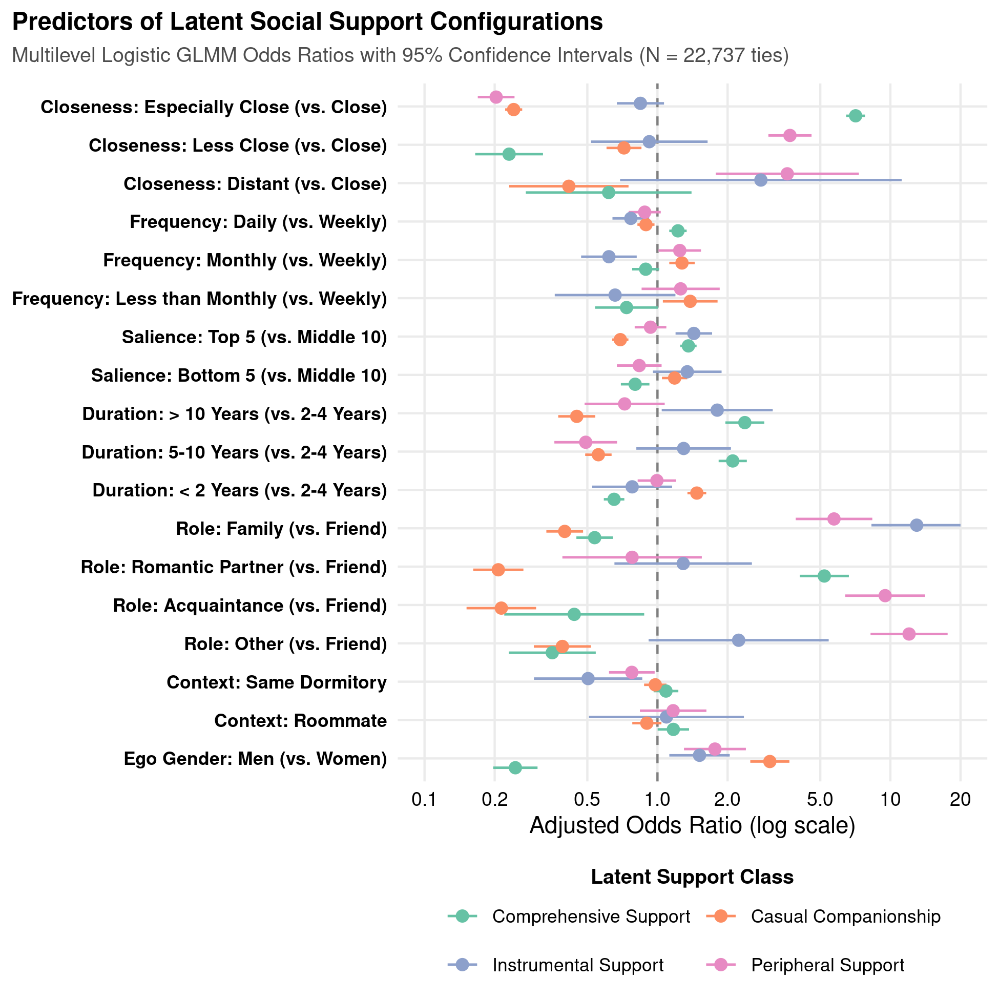

# Abstract

Theories of social networks often treat tie strength as a single continuum or conflate it with role relations and resource provision. Drawing on multi-wave panel data from the NetHealth Study (N = 22,739 ego–alter tie observations across N = 626 undergraduate participants), we untangle the multidimensional structure of tie strength, social roles, and social support. First, using Latent Class Analysis across four support exchanges (companionship, advice, comfort, and financial aid), we identify four distinct relational configurations: “Casual Companionship,” “Comprehensive Support,” “Instrumental Support,” and “Peripheral Support.” Second, using multilevel generalized linear mixed models with random ego intercepts, we predict membership in each inductively identified latent support configuration from tie strength indicators, role relations, and contextual attributes while accounting for dyadic clustering. Results show that emotional closeness, relationship duration, and cognitive salience strongly sort ties into comprehensive support, whereas peer friendships dominate casual companionship. Furthermore, role relations condition support regimes independently of tie strength: family ties show an extraordinary concentration of instrumental support, whereas romantic partners provide unmatched levels of comprehensive backing. Men's networks are disproportionately weighted toward casual companionship rather than multiplex support. These findings show that personal communities are organized through a functional division of relational labor rather than an undifferentiated gradient of tie strength.

# Introduction

The concept of tie strength occupies an indispensable role in structural sociology, social network analysis, and theories of social exchange (Borgatti et al., 2009; Granovetter, 1973; Kitts, 2014; Marsden & Campbell, 1984). In his seminal formulation, Granovetter (1973, p. 1361) defined tie strength as a “combination of the amount of time, the emotional intensity, the intimacy (mutual confiding), and the reciprocal services which characterize the tie.” While this multidimensional definition highlighted the multifaceted nature of interpersonal bonds, it simultaneously blended distinct conceptual domains into a single construct, conflating subjective sentiments (emotional closeness), observable behaviors (interaction frequency), relational history (duration), and functional exchanges (the provision of tangible assistance and social support).

In an influential methodological intervention, Marsden and Campbell (1984) clarified this conceptual ambiguity by distinguishing between *indicators* of tie strength and *predictors* of tie strength. Indicators represent the internal properties that constitute the strength of the bond itself, such as subjective emotional closeness, frequency of communication, and relationship duration. Predictors, by contrast, represent the structural and social contexts that generate or sustain strong ties, including social role relations (such as kin, friends, romantic partners, and acquaintances), sociodemographic similarity, and shared institutional affiliations (Feld, 1982). Despite this conceptual clarification, empirical scholarship has frequently slipped back into definitional conflation. In empirical applications, researchers often assume that kin and close friends are “strong ties” by definition, while neighbors, coworkers, and acquaintances are assumed to be “weak ties” (Lin, 2001; Wellman & Wortley, 1990). This conflation obscures crucial empirical variation: individuals routinely maintain emotionally distant or infrequently contacted relatives alongside intensely close and supportive casual associates.

As Lizardo (2024) argues in a recent theoretical formulation, this persistent conflation stems from a deeper failure to recognize that the concept of a social tie is organized across multiple distinct cognitive and relational frames. Specifically, tie conceptualizations routinely collapse four autonomous dimensions: *role frames* denoting categorical social positions (such as kin, friend, or coworker), *sentiment frames* capturing affective evaluations (such as closeness, liking, or trust), *behavioral interaction frames* indexing contact and communication patterns (such as daily or weekly activation), and *exchange frames* encompassing the functional transmission of resources (such as companionship, advice, comfort, or financial assistance). When researchers treat one frame as an automatic index of another—such as assuming that role relations define tie strength, that high interaction frequency entails emotional intimacy, or that strong ties universally provide all forms of social support—they commit a category mistake that obscures the underlying division of relational labor in personal networks. Role relations may carry institutional expectations of solidarity, yet actual sentiments and behavioral activations vary substantially within every role category (Marsden & Campbell, 1984). Similarly, frequent interaction is often driven by situational co-presence in shared organizational foci rather than affective depth (Feld, 1982; Kitts, 2014), while the provision of specialized support is bounded by domain-specific norms and resource affordances rather than a generalized gradient of strength.

To address this pervasive conceptual confounding, this study presents an empirical investigation that systematically decouples tie strength indicators, social role relations, and multidimensional support exchanges across personal networks. Analyzing multi-wave ego-network panel data from the NetHealth Study, which tracked undergraduate students across collegiate semesters at the University of Notre Dame, we use two analytical methods tailored to this structural complexity. Rather than imposing predetermined heuristic categories or assuming an additive hierarchy of support, we first use Latent Class Analysis (poLCA) across four primary support indicators (companionship, advice, comfort, and financial assistance) to identify empirical configurations of support inductively. We then specify multilevel generalized linear mixed models (GLMMs) with random ego intercepts, directly predicting membership in each identified latent support configuration from emotional closeness, interaction frequency, cognitive salience, and duration while conditioning on social role relations, ego gender identity, alter attributes, and residential proximity. By bridging inductive latent typologies with confirmatory multilevel regressions, this framework provides a rigorous structural foundation for evaluating how personal communities coordinate intimacy, interaction, and mutual assistance without definitional circularity.

# Theoretical Background and Research Questions

Social ties serve as the fundamental conduits through which individuals access psychosocial resources, instrumental help, and novel information (Borgatti et al., 2009; Lin, 2001). Building on the structural taxonomies proposed by Borgatti et al. (2009) and Kitts (2014), interpersonal connections can be characterized across four analytical planes: role relations (formal social positions such as family, friend, romantic partner, or coworker), interpersonal sentiments (affective closeness, trust, and liking), behavioral interactions (communication frequency and shared activities), and resource exchanges (the provision of informational, emotional, and material support).

Marsden and Campbell’s (1984) measurement model established that emotional closeness serves as the primary and most valid empirical indicator of tie strength, whereas contact frequency functions as an imperfect indicator that is heavily contaminated by institutional and organizational constraints. For example, coworkers or dormmates may interact daily due to physical proximity rather than mutual confiding, whereas geographically separated kin may interact infrequently while maintaining profound emotional intimacy. Similarly, cognitive salience—the cognitive accessibility of an alter as reflected in the order in which they are retrieved during name generation—reflects psychological prominence that may diverge from sheer contact volume (Kitts, 2014). Finally, relationship duration reflects the temporal accumulation of relational investments, yet whether longevity translates into active support depends heavily on role context.

As Smith (2021) emphasizes in a recent synthesis of ego-network research, the measurement of social support represents the single most common substantive application of personal network data (Cornwell et al., 2008; Fischer, 1982; Wellman & Wortley, 1990). Yet empirical investigations in this tradition often rely on aggregate summary measures—such as total network size or simple degree counts of available supporters—treating personal networks as an undifferentiated reservoir of assistance. As Smith (2021) argues, this aggregate approach obscures the reality that different alters offer fundamentally different resources: some provide material aid (financial assistance), others offer informational guidance (advice), and others supply expressive backing (emotional comfort) or everyday sociability. Because ego network surveys collect detailed information on the specific nature of each dyadic bond—including emotional closeness, contact frequency, duration, and role category—they provide the empirical resolution required to examine how distinct dimensions of tie strength activate specific functional exchanges. Decoupling these dimensions at the dyadic level reveals how personal communities organize a specialized division of relational labor, rather than assuming that strong ties universally provide all forms of aid.

These conceptual distinctions motivate several core empirical questions regarding how tie strength and role relations interact to structure social support provision:

First, how do the empirical indicators of tie strength correlate across different social role relations? If emotional closeness and interaction frequency represent partially autonomous dimensions, we should observe distinct tie-strength profiles across roles. In particular, family ties are expected to exhibit high emotional closeness despite lower everyday activation frequency compared to peer relationships on a residential campus.

Second, what empirical configurations of social support characterize personal networks when evaluated without arbitrary heuristic binning? Traditional analyses often assume an additive hierarchy of support, presuming that strong ties provide all forms of support while weak ties provide none. By applying Latent Class Analysis, we examine whether support exchanges cluster into specialized functional bundles, such as purely expressive support, casual socializing, or comprehensive multi-domain aid.

Third, when accounting for the clustering of ties within egos, does emotional closeness or interaction frequency better predict specific forms of assistance? We expect emotional closeness to serve as the primary determinant of expressive exchanges requiring confiding and vulnerability (advice and emotional comfort), whereas interaction frequency should primarily predict everyday companionship and casual sociability.

Fourth, to what extent do role relations condition support provision independently of tie strength? Certain resources, particularly financial assistance, involve material costs and institutional norms of obligation that may be restricted to specific role categories (such as family or romantic partners), regardless of how frequently an alter is contacted or how emotionally close they are reported to be.

# Data and Analytical Sample

The empirical data for this study come from the NetHealth Study (e.g., Liu et al., 2018; Sepulvado et al., 2020; Wang et al., 2020), a longitudinal investigation tracking an entire undergraduate cohort at the University of Notre Dame from matriculation in August 2015 through graduation in May 2019. The NetHealth study was designed to investigate the reciprocal co-evolution of social network structures, health behaviors (physical activity, sleep patterns, stress), and academic performance. Network surveys were administered online via Qualtrics at the beginning and conclusion of each semester across repeated waves between Fall 2015 and Spring 2018.

In each survey wave, participants completed an egocentric network module using a standardized open-ended name generator: “We would like to know who you consider to be in your social network. In the spaces below please list up to 20 people with whom you spend time communicating or interacting.” Beginning in Wave 3, respondents could additionally retain up to five alters from the preceding wave, allowing for up to 25 named alters per wave. Following name generation, respondents completed detailed name interpreters for each listed alter, recording demographic attributes, relationship type, emotional closeness, contact frequency, relationship duration, and residential proximity. Crucially, across Waves 2, 3, 4, 5, 7, and 8, respondents were administered a dedicated social support module inquiring whether each nominated alter had provided four specific forms of assistance over the preceding months: (1) companionship (`supphang`), denoting time spent socializing outside formal obligations; (2) advice (`suppadv`), representing guidance regarding personal or academic matters; (3) comfort (`suppcomf`), reflecting empathy, reassurance, or sympathetic listening during stressful periods; and (4) financial assistance (`suppfin`), encompassing money, loans, or emergency material aid.

For egos who were administered the support battery, unendorsed items represent the documented absence of that support type. We restricted the analytical sample to egos who completed the support module in each respective wave and eliminated records with incomplete covariate data. The final analytical sample consists of N = 22,739 ego-alter tie observations nested within N = 626 unique respondents across the six support-administered waves.

Tie strength indicators were coded following standardized survey categories: emotional closeness was recorded on a four-level ordinal scale (“Distant,” “Less than Close,” “Close,” and “Especially Close”); reported contact frequency was measured as “Less than Monthly,” “Monthly,” “Weekly,” or “Daily”; relationship duration was categorized into four temporal intervals (“Less than 1 Year,” “2–4 Years,” “5–10 Years,” and “More than 10 Years”); and cognitive salience was indexed both by exact nomination order (integers 1 through 20) and grouped into ordinal tiers (“Top 5,” “Middle 10,” and “Bottom 5”). Social role relations were standardized into five substantive categories: “Friend” (72.8% of nominations), “Family” (21.4%), “Romantic Partner” (2.8%), “Acquaintance” (1.4%), and “Other Role” (1.6%). Contextual controls include ego gender identity (women vs. men), alter gender, shared dormitory residence, and roommate status.

# Latent Typologies of Social Support

To identify the underlying structure of social support provision without imposing arbitrary Boolean grouping heuristics, we estimated Latent Class Analysis (poLCA) models across the four binary support indicators. We evaluated latent class solutions ranging from K = 2 to K = 5 classes. Table 1 reports the model fit statistics across the candidate specifications, including the log-likelihood, number of estimated parameters, Akaike Information Criterion (AIC), Bayesian Information Criterion (BIC), and classification entropy.

Table 1. **Model Fit Statistics for Latent Class Analysis of Social Support Exchanges**

{{TABLE_1}}

Note: Model estimation based on N = 22,739 ego-alter tie observations across Waves 2, 3, 4, 5, 7, and 8 of the NetHealth Study. Par indicates the number of estimated parameters. Optimal fit is identified by the four-class solution based on AIC and BIC minimization.

As reported in Table 1, moving from a two-class model to a three-class model yields a substantial reduction in both AIC (ΔAIC = −1,345.2) and BIC (ΔBIC = −1,305.0). Progressing from three to four classes provides a further improvement in model fit (AIC = 83,291.2; BIC = 83,443.8), while preserving high classification entropy (0.766). When moving to a five-class model, the BIC increases from 83,443.8 to 83,493.9 and the log-likelihood fails to improve, indicating parameter redundancy and overfitting. Consequently, the four-class solution was selected as the optimal empirical representation of social support configurations in this collegiate population.

From a methodological standpoint, the unit of analysis in this latent class model is the dyadic ego–alter tie observation (N = 22,739). Because ties are nested within respondents (N = 626), reports of social support exhibit moderate-to-substantial clustering at the ego level. Unconditional mixed-effects logistic models indicate that latent intraclass correlation coefficients (ICCs) range from 0.17 for financial aid to 0.29 for advice, 0.33 for comfort, and 0.34 for companionship, showing that between 17% and 34% of the variance in support reporting is attributable to unobserved respondent-level factors. With four binary indicators, however, there are only 2⁴ = 16 observable response profiles (15 degrees of freedom in the saturated multinomial table). Estimating complex multilevel mixture models with continuous random effects across this compact discrete space introduces severe empirical identification constraints. In our analytical design, we therefore use the single-level LCA strictly as an inductive, taxonomical tool to map population-averaged support configurations across dyads—substituting empirical clustering for arbitrary manual groupings. Crucially, we do not rely on the LCA for hypothesis testing or covariate evaluation; all confirmatory inference, standard errors, and predictor effects are reserved for the subsequent multilevel regression framework, where clustering within egos is explicitly modeled.

Figure 1. **Conditional Item Response Probabilities Across Latent Social Support Classes**

Note: Latent class profiles estimated via `poLCA` across four binary social support indicators (N = 22,739 tie observations). Bars represent the conditional probability of endorsing each support exchange given membership in that latent class.

Figure 1 illustrates the conditional item response probabilities that define the four latent support classes. The first class, which we label “Casual Companionship,” encompasses 45.8% of all analyzed ties. Ties in this class have a 1.00 probability of providing companionship (hanging out) but a 0.00 probability of providing financial assistance, accompanied by modest probabilities of providing advice (0.26) or comfort (0.16). This class reflects everyday collegiate socializing that lacks deep confiding or material exchange. The second class, designated “Comprehensive Support,” encompasses 41.5% of ties and represents emotionally intimate relationships characterized by high probabilities of advice (0.99), comfort (0.97), and companionship (0.99), alongside a moderate likelihood of financial aid (0.21). The third class, labeled “Instrumental Support” (4.3% of ties), displays a distinctive profile: it exhibits high probabilities of financial assistance (0.68), advice (0.88), and emotional comfort (0.83), but a low probability of companionship (0.29). Finally, the fourth class, labeled “Peripheral Support” (8.4% of ties), exhibits depressed endorsement rates across all four domains, with companionship reaching only 0.36 and financial aid just 0.12.

Table 2. **Distribution of Latent Support Classes by Social Role Relation and Emotional Closeness**

{{TABLE_2}}

Note: Cell entries represent row percentages displaying the proportion of ties within each role or closeness category assigned to the respective latent support class (N = 22,739).

Table 2 presents the cross-classification of assigned latent support classes across social role relations (Panel A) and emotional closeness levels (Panel B). The empirical sorting reveals pronounced institutional and affective specialization. Among friends, ties are split predominantly between Casual Companionship (53.8%) and Comprehensive Support (40.5%), with virtually zero presence in Instrumental Support (1.0%). By contrast, family ties are heavily concentrated in Comprehensive Support (58.3%) and Instrumental Support (17.8%), while Casual Companionship accounts for only 15.3%. Romantic partners exhibit the highest concentration of Comprehensive Support (81.7%), with minimal peripheral categorization (1.9%). Acquaintances and other roles are primarily relegated to Peripheral Support (49.3% and 33.5%, respectively) and Casual Companionship.

Examining Panel B of Table 2 shows that emotional closeness strongly stratifies support configurations. Ties classified as “Especially Close” are overwhelmingly located in Comprehensive Support (61.7%), whereas ties categorized as “Close” or “Less Close” are predominantly confined to Casual Companionship (69.3% and 66.5%, respectively). Peripheral support is heavily concentrated among distant and less close ties, showing that emotional intimacy is an indispensable prerequisite for multi-domain support provision.

# Multilevel Models: Predicting Latent Support Configurations

To test how tie strength indicators and role relations independently predict membership in each of the inductively identified support configurations while accounting for the nesting of multiple ties within respondents, we formulated multilevel generalized linear mixed models (GLMMs) with a logit link function. Rather than predicting disaggregated individual support items—which would render the latent class typologizing redundant—the dependent variables in this confirmatory stage are the four distinct relational regimes identified by the LCA: Comprehensive Support, Casual Companionship, Instrumental Support, and Peripheral Support.

For each latent support category k (where k ∈ {Comprehensive, Casual Companionship, Instrumental, Peripheral}), the probability that a dyadic tie i nested within ego j is assigned to class k is modeled as:

logit(P(Y_ij = k)) = β_0k + X_ij β_k + u_jk

where X_ij represents the vector of tie-level strength indicators (affective closeness, contact frequency, cognitive salience, and duration), social role relations, and dyadic controls, β_k is the class-specific vector of fixed-effect coefficients, and u_jk ~ N(0, σ_uk²) represents the ego-specific random intercept for class k. By capturing unobserved respondent-level variance—such as individual baseline sociability, reporting thresholds, or dispositional tendencies to perceive support—the inclusion of u_jk prevents standard error deflation and accounts for dyadic clustering within personal networks. Latent intraclass correlation coefficients (ICCs) demonstrate substantial ego-level clustering across all four configurations, ranging from 0.248 for Casual Companionship (σ_u² = 1.082) to 0.307 for Comprehensive Support (σ_u² = 1.457), 0.356 for Instrumental Support (σ_u² = 1.821), and 0.380 for Peripheral Support (σ_u² = 2.016).

From an estimation standpoint, specifying separate binary GLMMs for each latent configuration offers distinct methodological advantages over simultaneous multinomial mixed models (such as `mclogit::mblogit`). In dyadic network data, certain cross-classifications between role relations and specialized support regimes contain extreme cell sparsity—most notably, acquaintances providing instrumental kin support (n = 1). Under frequentist Fisher scoring or Newton-Raphson algorithms in multinomial settings, these sparse cells induce quasi-complete separation, producing non-convergence warnings and unstable covariance matrices. The binary GLMM framework avoids these computational pathologies, preserves full categorical granularity across all role categories and duration intervals, and allows the respondent-level variance (σ_uk²) to vary freely across distinct support regimes. Table 3 presents the estimated odds ratios (ORs) and 95% confidence intervals from these multilevel models across the four latent support configurations.

Table 3. **Multilevel Mixed-Effects Logistic Regression Models Predicting Latent Social Support Configurations**

{{TABLE_3}}

Note: Sample size N = 22,737 tie observations nested within N = 581 unique egos (ties with unknown duration omitted). Models include random ego intercepts (`(1 | egoid)`). Odds ratios (OR) are reported with 95% confidence intervals in parentheses. Statistical significance: * p < 0.05, ** p < 0.01, *** p < 0.001.

Figure 2. **Adjusted Odds Ratios from Multilevel Logistic GLMMs Predicting Latent Social Support Configurations**

Note: Forest plot of adjusted odds ratios and 95% confidence intervals estimated from multilevel logistic regression models with random ego intercepts (N = 22,737 ties across N = 581 egos). The dashed vertical line indicates the null effect (OR = 1.0). The horizontal axis is plotted on a logarithmic scale. The estimate for acquaintances predicting instrumental support exhibits quasi-complete separation due to cell sparsity (n = 1, SE = 271.99) and is omitted from the plot to preserve visual scale.

Figure 2 visualizes the estimated odds ratios across the four latent social support configurations, allowing for direct comparison of how tie strength and role relations sort personal networks into distinct relational regimes. The parameter estimates demonstrate clear empirical patterns:

First, emotional closeness and long-term history serve as the primary engines sorting ties into Comprehensive Support. Relative to ties evaluated as “Close,” alters characterized as “Especially Close” exhibit more than a sevenfold increase in the odds of providing comprehensive support (OR = 7.09, 95% CI [6.46, 7.79]), whereas “Less Close” ties show an 77% reduction in odds (OR = 0.23, p < 0.001). Relationship duration demonstrates powerful cumulative returns: ties maintained for 5–10 years (OR = 2.10, p < 0.001) and more than 10 years (OR = 2.37, p < 0.001) are more than twice as likely to provide comprehensive backing compared to newer ties (2–4 years). Cognitive salience also enhances access (Top 5: OR = 1.36, p < 0.001), while daily activation yields a modest elevation (OR = 1.22, p < 0.001). Net of tie strength, romantic partners are more than five times as likely as friends to occupy the comprehensive support regime (OR = 5.20, 95% CI [4.08, 6.63]).

Second, Casual Companionship is overwhelmingly structured by peer friendships and moderate affective intimacy. Relative to friends, family members (OR = 0.40, p < 0.001), romantic partners (OR = 0.21, p < 0.001), and acquaintances (OR = 0.21, p < 0.001) are all substantially less likely to provide exclusively casual companionship. Interestingly, ties evaluated as “Especially Close” show sharply lower odds of remaining in this class (OR = 0.24, p < 0.001), because extreme affective closeness shifts ties into Comprehensive Support. Similarly, alters nominated in the Top 5 salience tier are less likely to be casual companions (OR = 0.69, p < 0.001), confirming that cognitive retrieval prioritizes substantive confidants over recreational peers.

Third, Instrumental Support is governed by kinship obligations rather than campus proximity or daily interaction. Family ties exhibit a staggering thirteen-fold elevation in the odds of providing instrumental support relative to friends (OR = 12.98, 95% CI [8.29, 20.30]). By contrast, acquaintances virtually never provide instrumental backing (OR < 0.01). Daily contact frequency is negatively associated with instrumental support (OR = 0.77, p = 0.005), reflecting the spatial dispersion of collegiate students from the parental households that provide financial and material backing. Long-standing duration (> 10 years: OR = 1.81, p = 0.035) and Top 5 cognitive salience (OR = 1.43, p < 0.001) further underscore that instrumental ties represent core familial anchors.

Fourth, Peripheral Support captures relational ties characterized by weak sentiments, formal roles, and minimal resource transmission. Ties evaluated as “Less Close” (OR = 3.71, p < 0.001) and “Distant” (OR = 3.61, p < 0.001) show nearly fourfold increases in the odds of being peripheral relative to “Close” ties, while “Especially Close” ties are rarely peripheral (OR = 0.20, p < 0.001). Role relations exhibit sharp sorting: acquaintances (OR = 9.50, p < 0.001) and other non-intimate roles (OR = 12.03, p < 0.001) are heavily concentrated in the peripheral tier. Long-term relational duration acts as a protective buffer against marginalization (5–10 years: OR = 0.49, p < 0.001).

Finally, respondent gender identity and organizational context reveal pronounced structural differences. Men report substantially lower odds of maintaining ties in Comprehensive Support (OR = 0.25, p < 0.001), but more than a threefold increase in the odds of Casual Companionship ties (OR = 3.04, p < 0.001), illustrating a stark gendered division where men's personal communities are disproportionately weighted toward activity-based socializing rather than multiplex expressive confiding. Roommates show modestly higher odds of Comprehensive Support (OR = 1.17, p = 0.046), whereas shared dormitory residence reduces the likelihood of ties falling into Instrumental Support (OR = 0.50, p = 0.012) or Peripheral Support (OR = 0.78, p = 0.026).

# Discussion and Conclusion

This study set out to investigate the empirical links between tie strength, social role relations, and social support exchanges across personal networks, moving beyond the conceptual confounding that has long characterized research on social capital. Building on Lizardo’s (2024) frame-analytic model and Marsden and Campbell’s (1984) measurement framework, our analytical strategy decoupled role categories, affective sentiments, interaction frequencies, and functional support provisions. By combining Latent Class Analysis with Multilevel Generalized Linear Mixed Models, we eliminated the need for arbitrary heuristic groupings of support exchanges, properly accounted for the clustering of multiple dyadic ties within respondents, and evaluated the independent predictive contributions of distinct tie-strength dimensions net of role relations and demographic contexts.

Substantively, the empirical results provide strong support for Marsden and Campbell’s (1984) foundational argument that tie strength is fundamentally multidimensional and cannot be reduced to a single linear index or equated with role labels. Emotional closeness, interaction frequency, cognitive salience, and duration each exhibit distinct predictive profiles across support domains. Emotional closeness functions as the indispensable foundation for expressive support (emotional comfort and personal advice), whereas interaction frequency predominantly regulates companionship and everyday sociability. Cognitive salience in the name-generation process captures psychological prominence that enhances access to substantive assistance beyond reported closeness and frequency.

Furthermore, our findings illuminate the specialized functional division of labor embedded within personal networks. Rather than observing an undifferentiated continuum from “weak” to “strong” ties, the Latent Class Analysis shows that ties organize into discrete relational regimes: casual companionship ties that provide sociability without confiding or material exchange; comprehensive support ties that bundle intimacy, advice, and companionship; and instrumental kin ties that provide vital material and informational backing despite low everyday interaction frequency. Role relations establish normative boundaries around specific resources: financial assistance remains overwhelmingly anchored in family relationships, whereas companionship is almost exclusively negotiated through peer friendships.

These findings have direct implications for contemporary theories of social capital. Access to diverse forms of social capital depends not merely on the aggregate volume of ties or the presence of bridging weak ties, but on maintaining a functionally balanced portfolio of personal relationships. While campus friendships provide essential everyday companionship and peer guidance, they rarely substitute for the material and long-term security provided by family ties. Future research should leverage these multilevel insights to examine within-tie panel trajectories, investigating how the formation, activation, and dissolution of specific support exchanges track personal transitions across the early adult life course.

# References

Borgatti, S. P., Mehra, A., Brass, D. J., & Labianca, G. (2009). Network analysis in the social sciences. *Science*, 323(5916), 892–895. https://doi.org/10.1126/science.1165821

Cornwell, B., Laumann, E. O., & Schumm, L. P. (2008). The social connectedness of older adults: A national profile. *American Sociological Review*, 73(2), 185–203. https://doi.org/10.1177/000312240807300201

Feld, S. L. (1982). Social structural determinants of similarity among associates. *American Sociological Review*, 47(6), 797–801. https://doi.org/10.2307/2095213

Fischer, C. S. (1982). *To Dwell Among Friends: Personal Networks in Town and City*. University of Chicago Press.

Granovetter, M. S. (1973). The strength of weak ties. *American Journal of Sociology*, 78(6), 1360–1380. https://doi.org/10.1086/225469

Kitts, J. A. (2014). Beyond networks in structural theories of exchange: Promises from computational social science. In S. R. Thye & E. J. Lawler (Eds.), *Advances in Group Processes* (Vol. 31, pp. 263–298). Emerald Group Publishing Limited. https://doi.org/10.1108/S0882-614520140000031008

Lin, N. (2001). *Social Capital: A Theory of Social Structure and Action*. Cambridge University Press. https://doi.org/10.1017/CBO9780511815447

Liu, S., Hachen, D., Lizardo, O., Poellabauer, C., Striegel, A., & Milenković, T. (2018). Network analysis of the NetHealth data: Exploring co-evolution of individuals’ social network positions and physical activities. *Applied Network Science*, 3(1), 45. https://doi.org/10.1007/s41109-018-0103-2

Lizardo, O. (2024). Theorizing the concept of social tie using frames. *Social Networks*, 78, 80–91. https://doi.org/10.1016/j.socnet.2024.01.001

Marsden, P. V., & Campbell, K. E. (1984). Measuring tie strength. *Social Forces*, 63(2), 482–501. https://doi.org/10.2307/2579058

Sepulvado, B., Wood, M., Wang, C., Fridmanski, E., Chandler, M., Lizardo, O., & Hachen, D. (2020). Predicting homophily and social network connectivity from dyadic behavioral similarity trajectory clusters. *Social Science Computer Review*, 40(1), 186–205. https://doi.org/10.1177/0894439320923123

Smith, J. A. (2021). The continued relevance of ego network data. In R. Light & J. Moody (Eds.), *The Oxford Handbook of Social Networks* (pp. 170–187). Oxford University Press. https://doi.org/10.1093/oxfordhb/9780190251765.013.15

Wang, C., Lizardo, O., & Hachen, D. S. (2020). Neither influence nor selection: Examining co-evolution of political orientation and social networks in the NetSense and NetHealth studies. *PLOS ONE*, 15(5), e0233458. https://doi.org/10.1371/journal.pone.0233458

Wellman, B., & Wortley, S. (1990). Different strokes from different folks: Community ties and social support. *American Journal of Sociology*, 96(3), 558–588. https://doi.org/10.1086/229572
